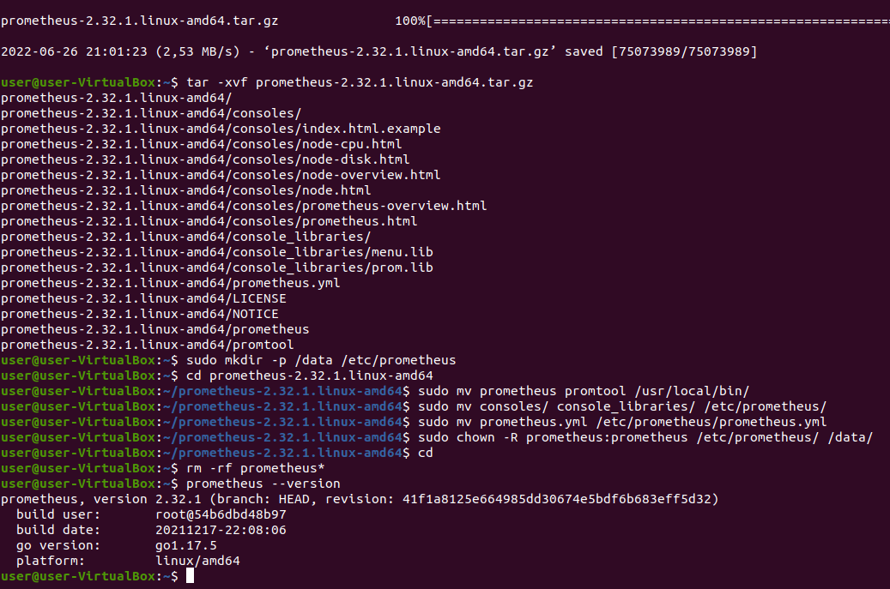
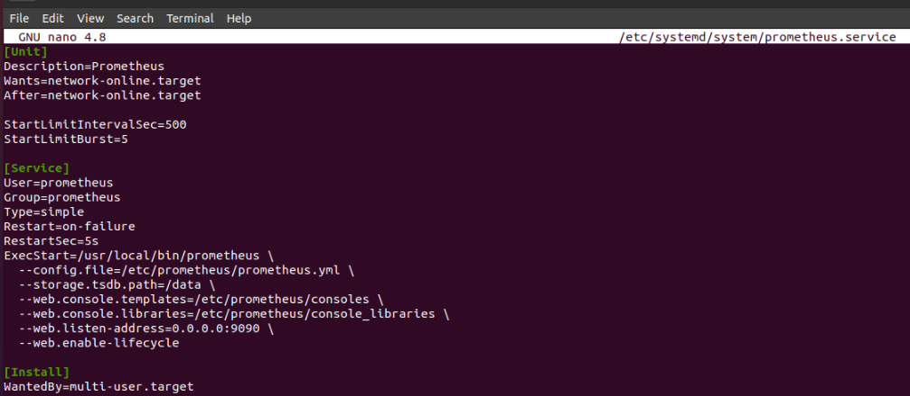
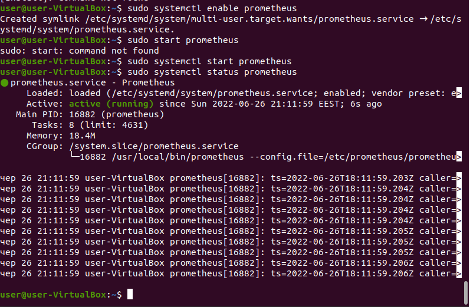
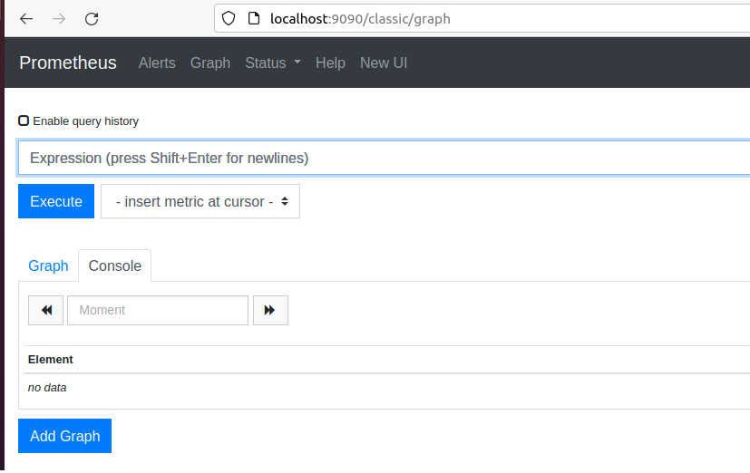
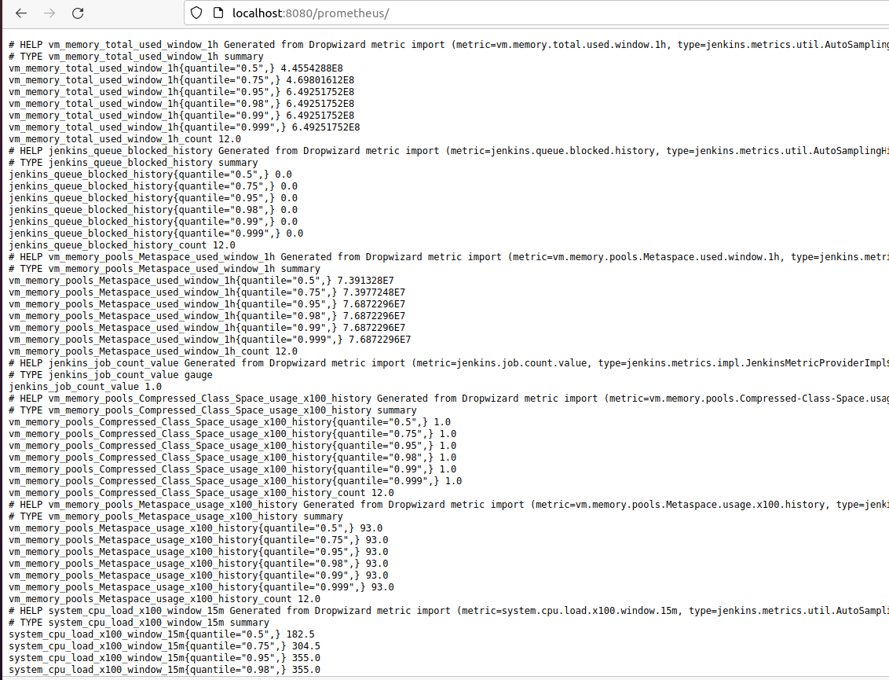
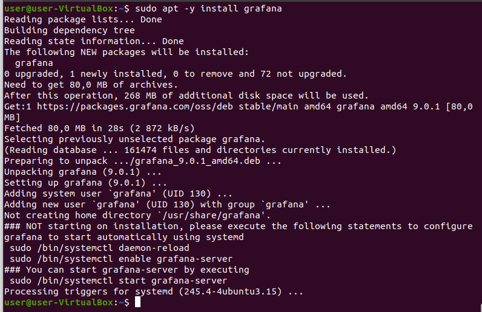
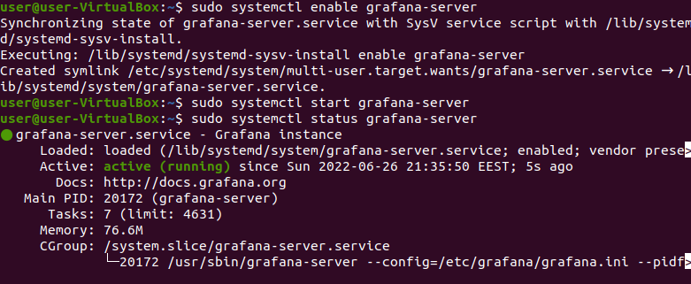
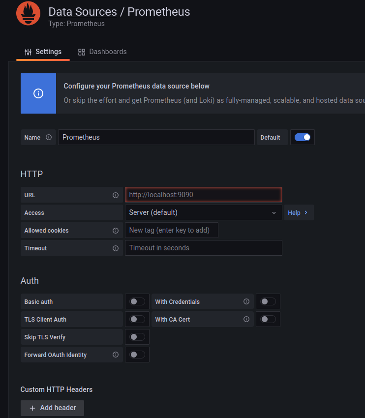
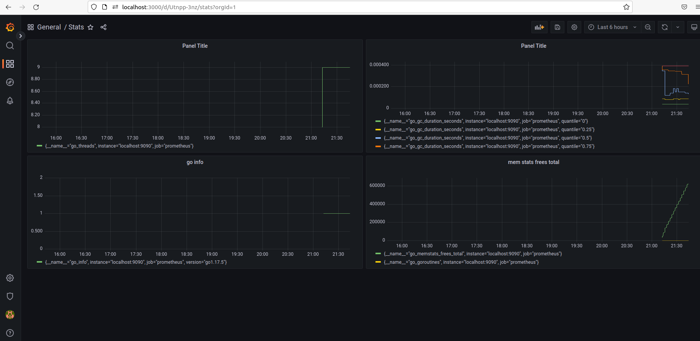

Lab 12

 

Installing Prometheus

 

Prometheus config file

 

Starting Prometheus service

 

Prometheus Web UI

 

Prometheus plugin for Jenkins

 

Installing Grafana

 

Grafana is running

 

Grafana Web UI Login page

 

Grafana add Prometheus as Data Source

 

Grafana Dashboard Panel view

 