<details>
<summary>1) Login via SSH with password</summary>

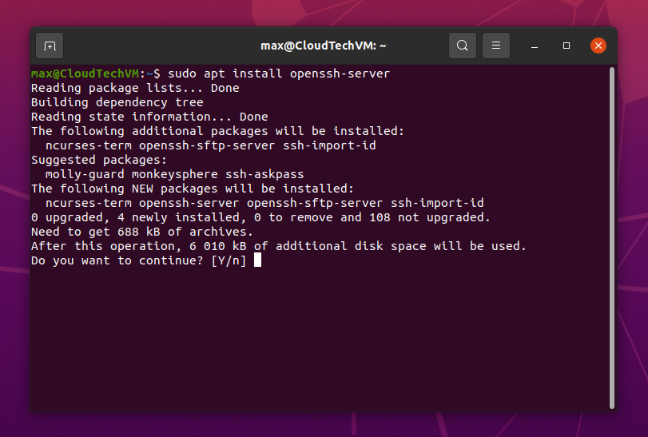

<br/>

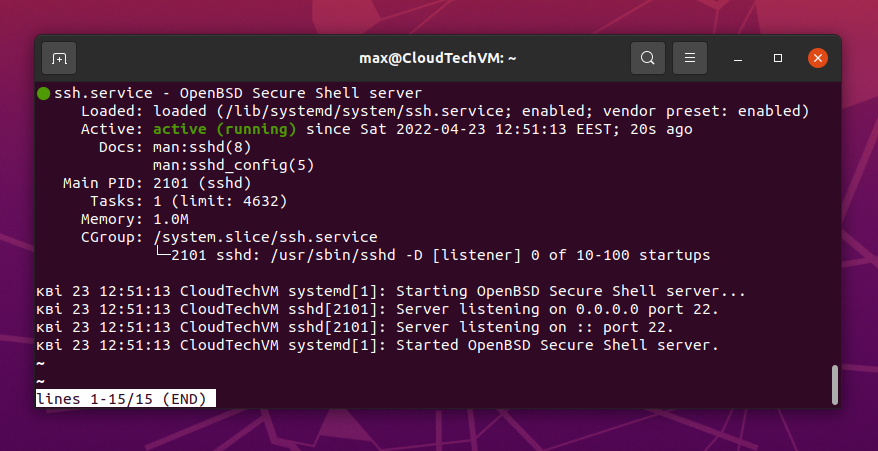

<br/>

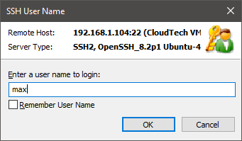

<br/>

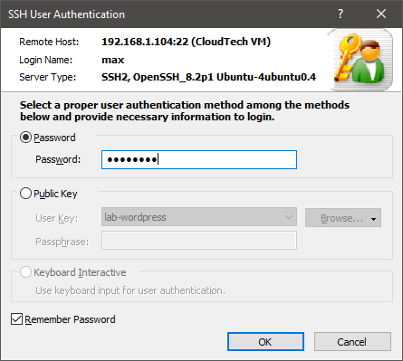

<br/>

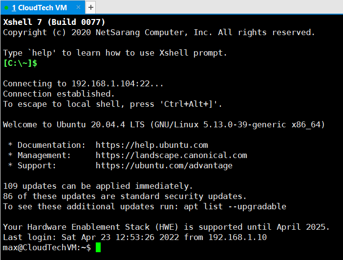

</details>
<br/>

<details>
<summary>2) Login via SSH with keys</summary>

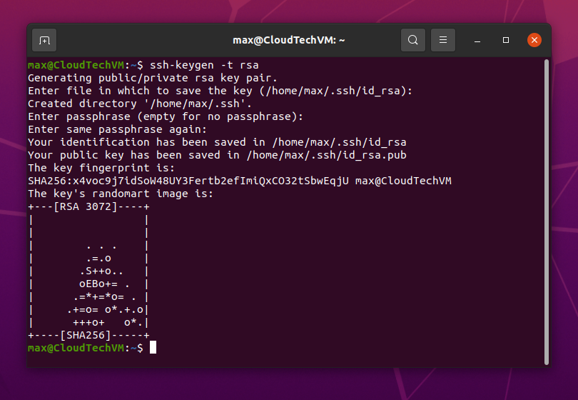

<br/>

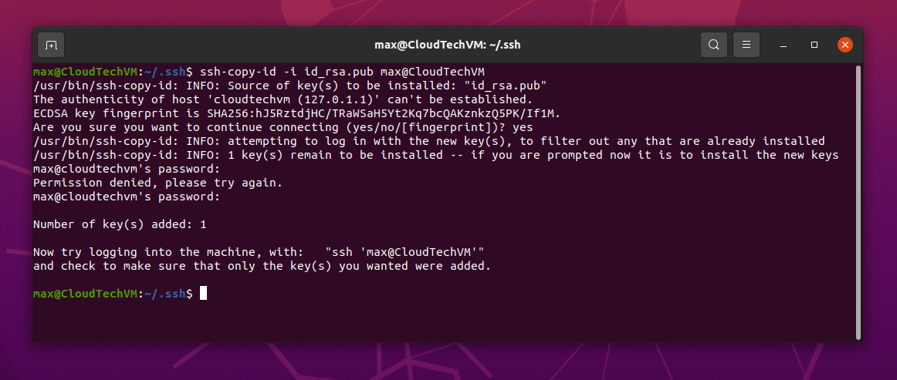

<br/>

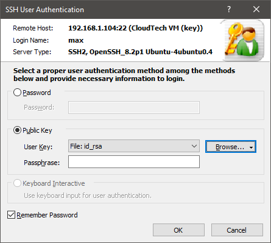

<br/>

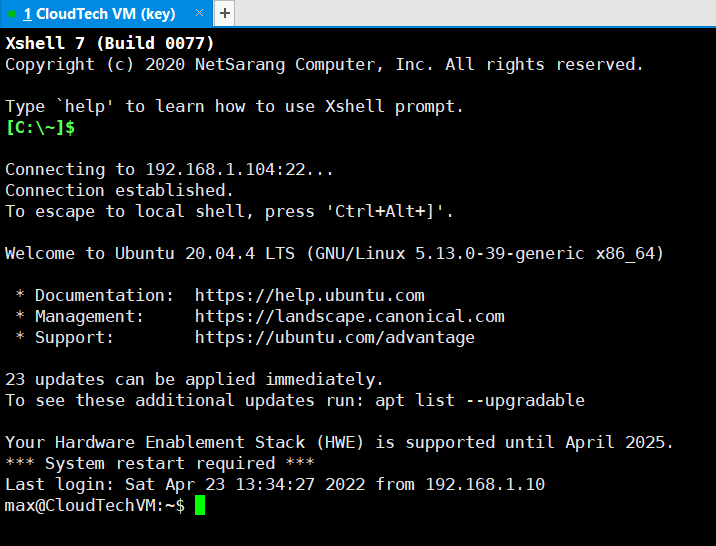

<br/>

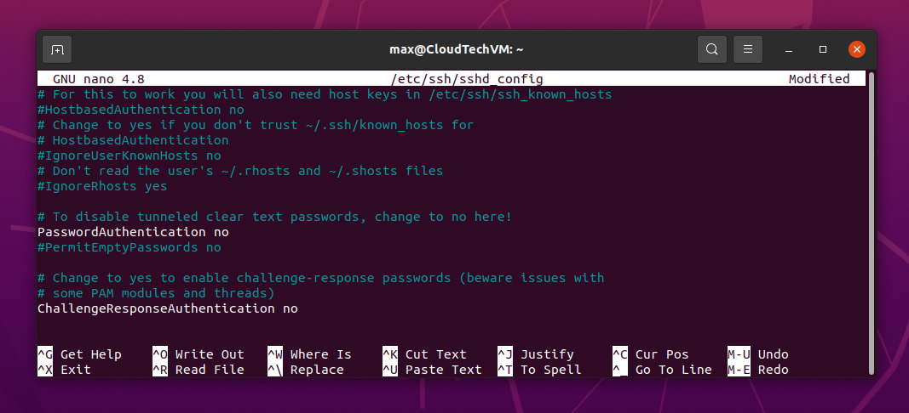

<br/>

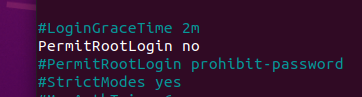

<br/>

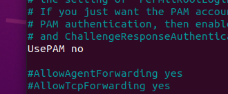

</details>

<br/>

<details>
<summary>3) Change default SSH port</summary>

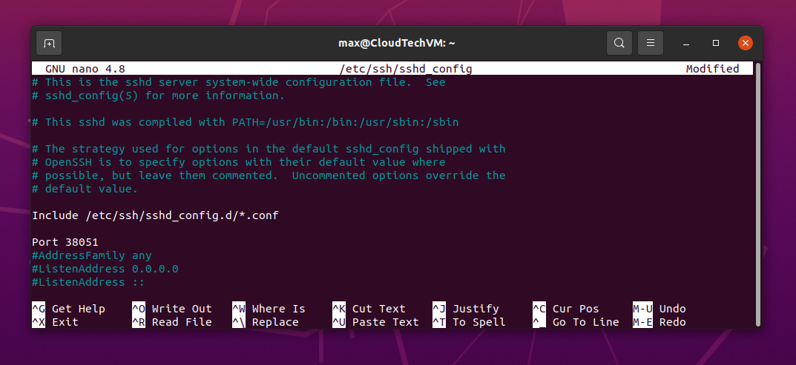

<br/>

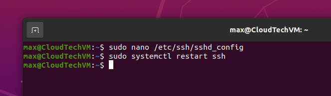

<br/>

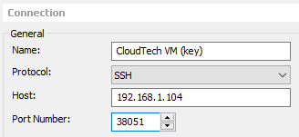

<br/>

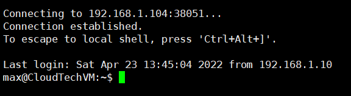

</details>

<br/>

<details>
<summary>What is port forwarding?</summary>

<p>
SSH port forwarding is a mechanism in SSH for tunneling application ports from the client machine to the server machine, or vice versa. 
It can be used for adding encryption to legacy applications, going through firewalls,
and some system administrators and IT professionals use it for opening backdoors into the internal network from their home machines. 
It can also be abused by hackers and malware to open access from the Internet to the internal network.
</p>

<p>
Command:

```
ssh -L 80:intra.example.com:80 gw.example.com
```
</p>

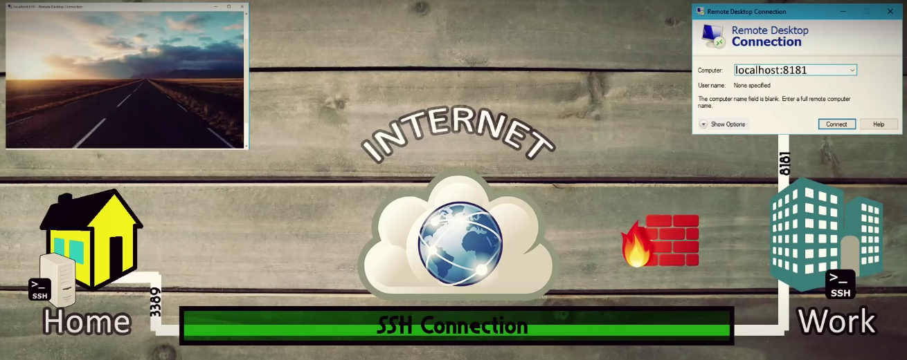
</details>