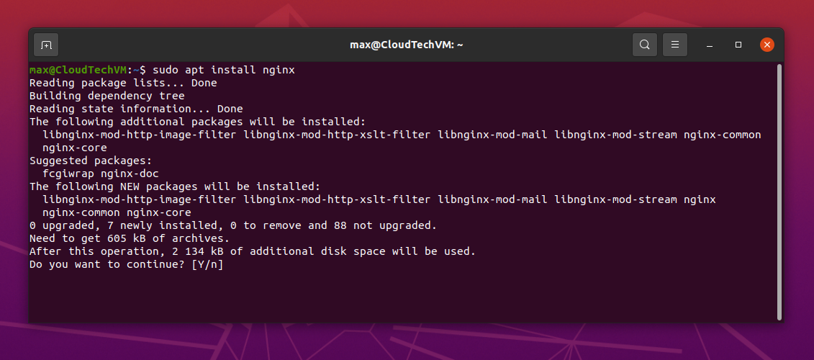

Installation & configuration NGINX

 

Install NGINX

 

Allow access via HTTP 80 port

 

Open in browser for test

 

Install other software

 

Install PHP & MySQL

 

Download, unpack and install Wordpress

 

 

NGINX configuration

 

 

WordPress configuration

 

 

Create DB, user and setup access control

 

Fill up database connection info for WordPress

 

Setup main user data

 

