

Create repo & keys

 

Create another repo for tests

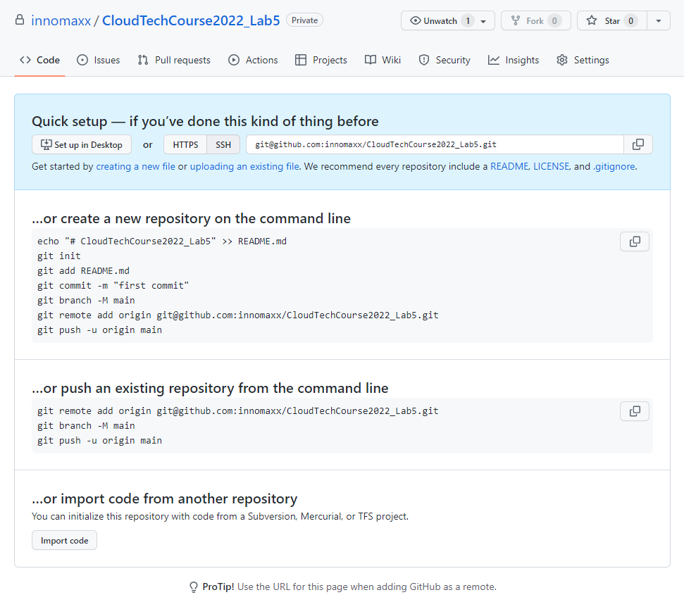

 

Generate SSH keys for access

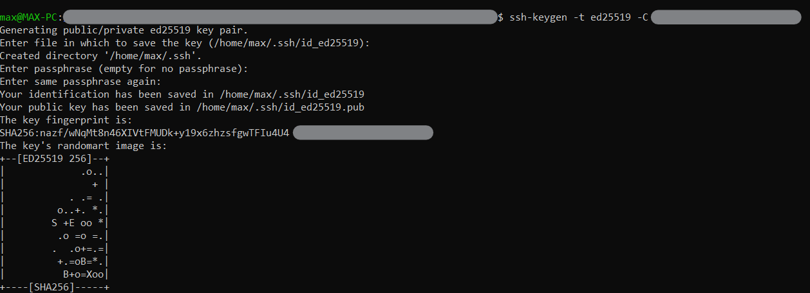

 

Add generated public key to GitHub

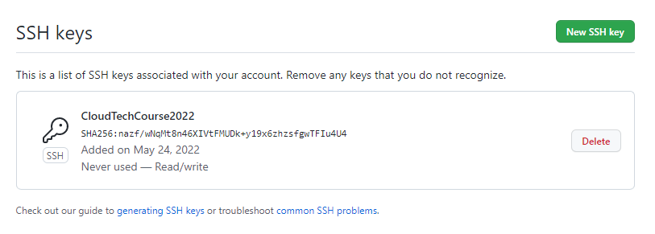

 

Try login to GitHub SSH to test key registered

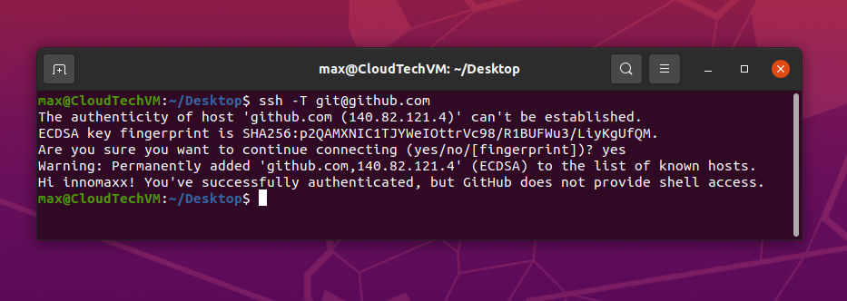

 

Actions with repo

 

Pull private repo

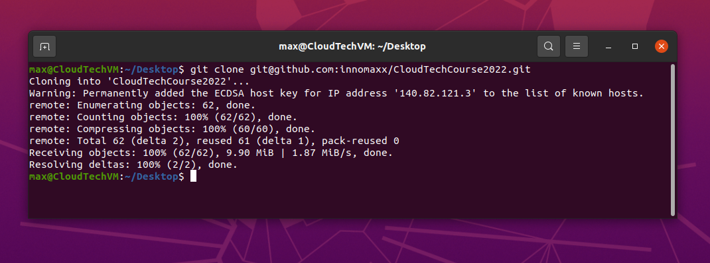

 

Create file "file.txt" in two branches

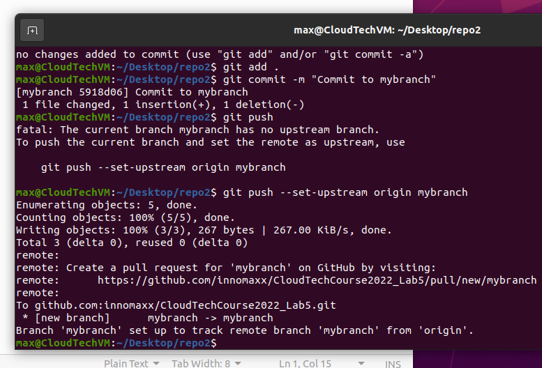

 

 

Try simulate merge conflict

 

Add text to `main` branch

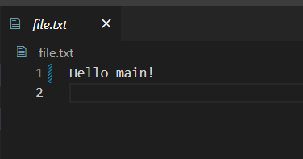

 

Add text to `mybranch` branch

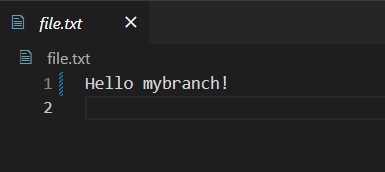

 

Try merge `mybranch` to `main` branch

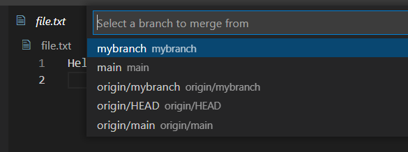

 

Solve merge conflict: Accept incoming changes

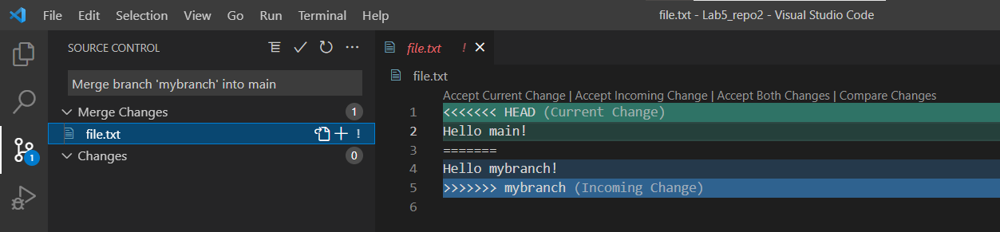

 

Stage changes

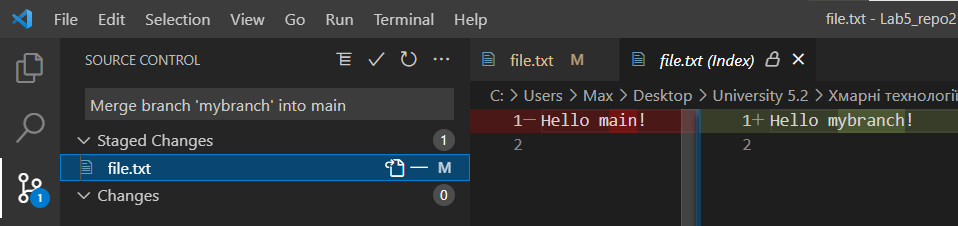

 

Merged branch after the conflict

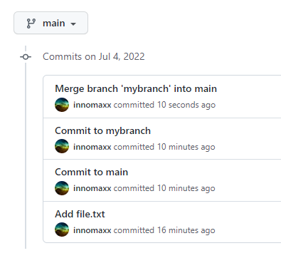