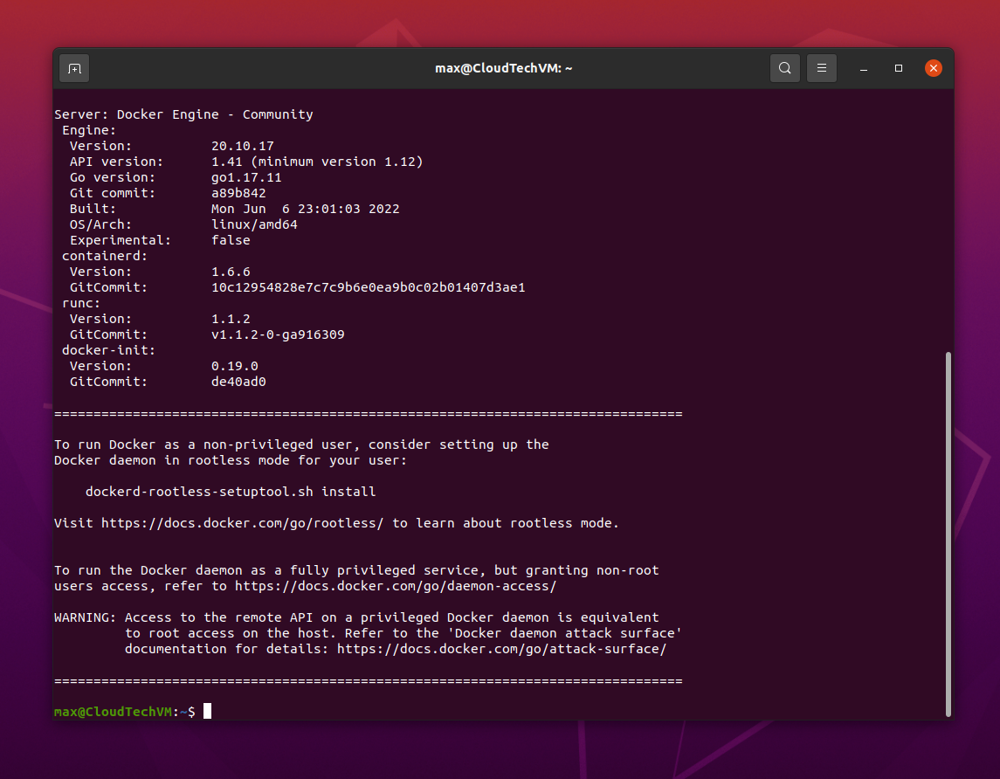
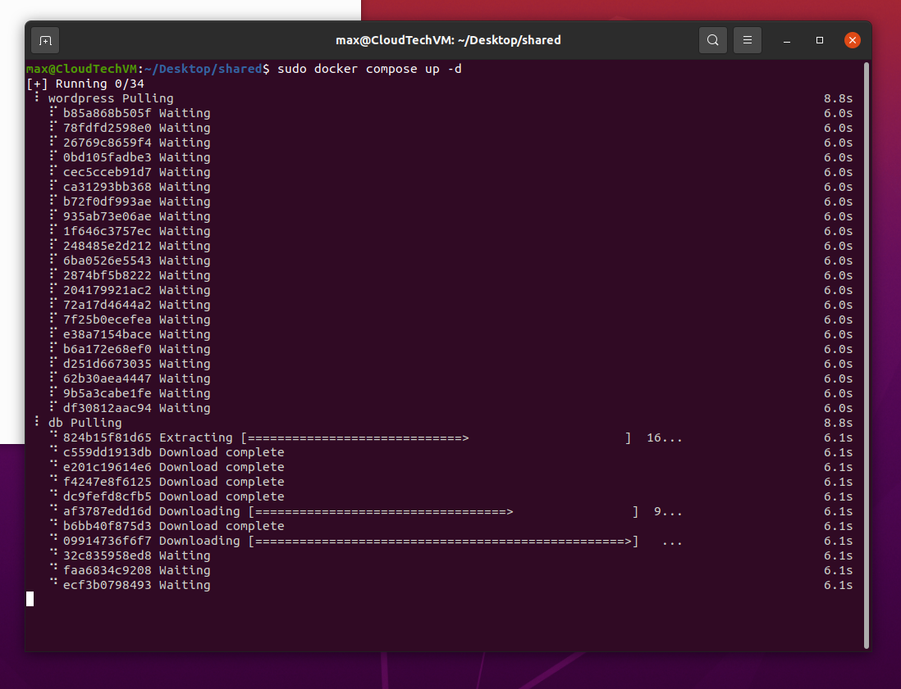
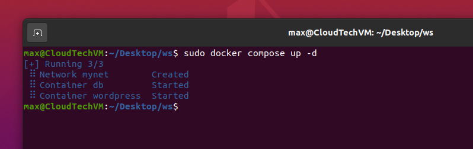
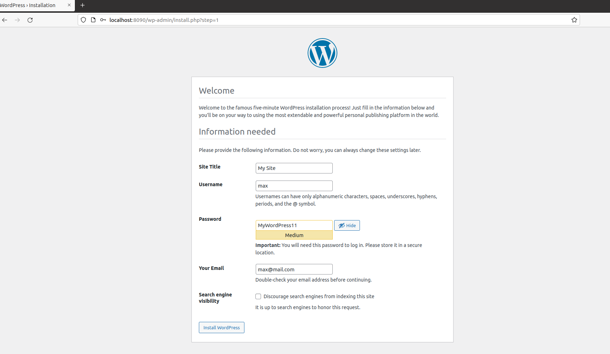
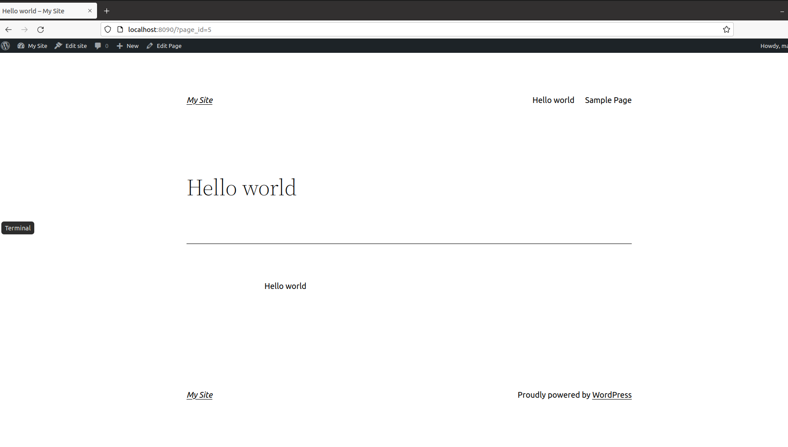
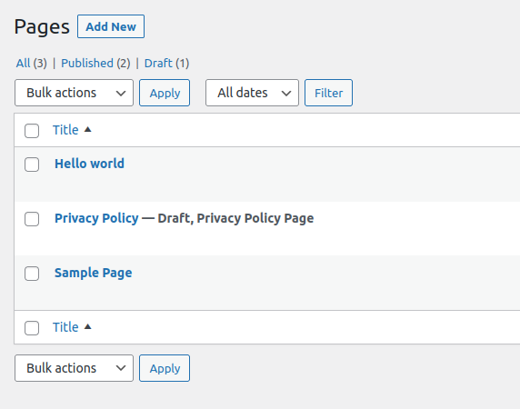
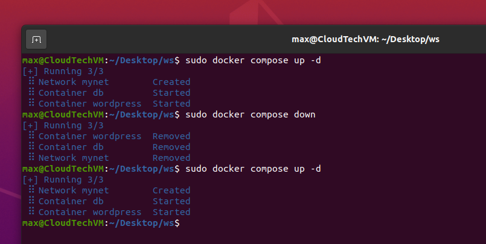
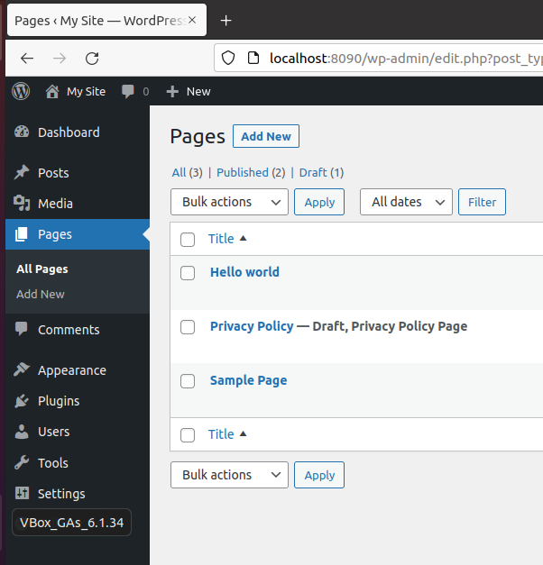

Configure Docker

 

Install Docker

 

Run containers via Docker Compose

 

 

Sign up in Wordpress instance

 

Create a post

 

Check created post in posts list

 

Recreate containers

 

Check post exists

 